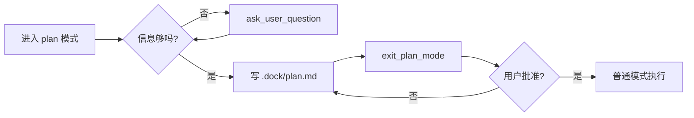

# 计划：演示一份「完整」的计划模板

> 用途：测试计划模式下 `.dock/plan.md` 的渲染与流程。
> 本计划不会真正执行——批准后只做最小化的演示改动。

---

## 1. 背景与目标

计划模式用于**先对齐、后执行**：在动手前把目标、范围、步骤、风险摊开，减少返工。
本次「演示计划」的目标是：

- 覆盖典型章节（背景、目标、范围、步骤、风险、回滚、待澄清、验收）
- 演示 Mermaid / 代码块 / 表格 / 任务清单的渲染
- 验证 `exit_plan_mode` 后能正确切回普通模式

## 2. 范围

| 在范围内 | 不在范围内 |
| --- | --- |
| 写入 `.dock/plan.md` 模板 | 修改业务代码 |
| 演示章节结构 | 执行 CI / 部署 |
| 跑一次轻量校验 | 引入新依赖 |

## 3. 架构 / 设计草案

```text
┌────────────┐   探索   ┌──────────────┐
│  plan mode │ ───────▶ │  .dock/plan  │
└─────┬──────┘          └──────┬───────┘
      │  exit_plan_mode        │
      ▼                        ▼
  用户审阅 ←──────────── 内容已就绪
```

## 4. 实施步骤

1. **探索**：用 `list_dir` / `grep` 摸清目录结构
2. **澄清**：必要时用 `ask_user_question` 收敛歧义
3. **起草**：把方案写入 `.dock/plan.md`（本文件）
4. **提交**：调 `exit_plan_mode` 等用户批准
5. **执行**：批准后再用普通工具改文件 / 跑命令

## 5. 任务清单

- [x] 进入计划模式
- [x] 写出章节完整的计划文件
- [ ] 用户审阅 / 反馈
- [ ] 调用 `exit_plan_mode`

## 6. 风险与权衡

- **风险 1**：写文件在某些受限策略下被拦截
  - *缓解*：先用只读命令确认目录与权限
- **风险 2**：计划过于冗长，用户审阅疲劳
  - *缓解*：把"必读"放前面，附录放后面
- **备选方案**：纯文字 + 编号清单，不带图表

## 7. 回滚

- 计划模式本身不写业务代码；若用户拒绝，仅删除 `.dock/plan.md` 即可

## 8. 验收标准

- 计划文件存在且包含本节"任务清单"中所有勾选项
- 用户在 `exit_plan_mode` 弹窗中能完整看到章节
- 批准后能切回普通模式继续工作

## 9. 待澄清问题

- 真实场景下，目标 / 范围 / 验收标准 需要用户进一步说明
- 本演示无需澄清

## 附录 A：可用的子工具速查

```text
探索    list_dir / read_file / grep / glob / lsp
搜索    memory_search / memory_get / web_search / web_fetch
计划    ask_user_question / enter_plan_mode / exit_plan_mode
执行    write_file / search_replace / bash
编排    todo_write / workflow / task / monitor
调度    scheduler_create / scheduler_list / scheduler_delete
```

## 附录 B：示例 Mermaid 流程图



---

*计划结束 — 等待用户审阅。*
