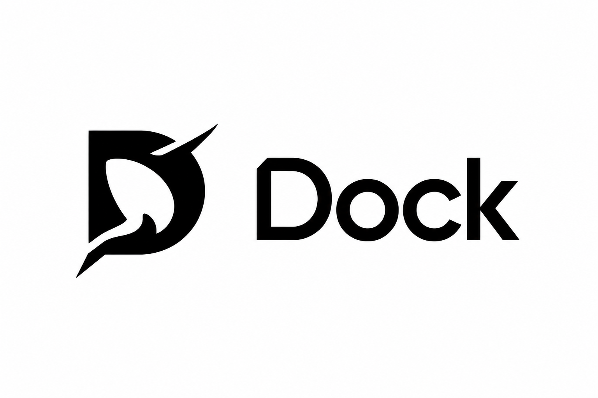
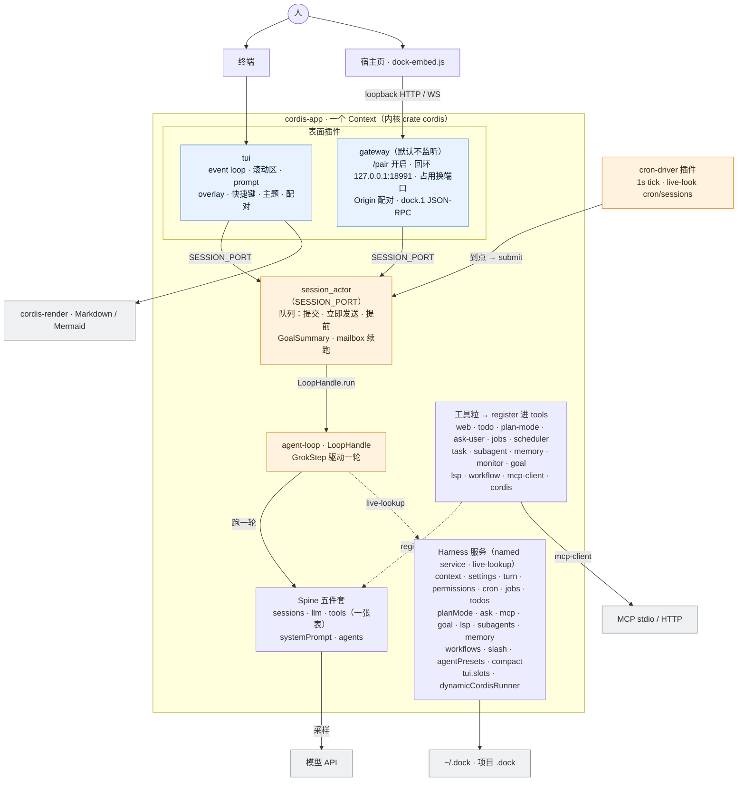
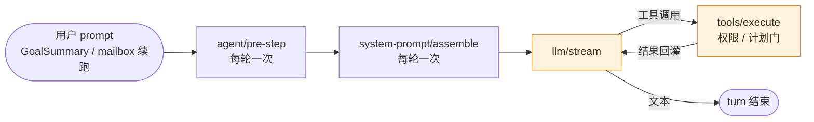

<p align="center">
  
</p>
<h1 align="center">Dock</h1>
<p align="center">
  <b>Grok 外形的本地 Agent TUI · 一切皆插件</b>
</p>
<p align="center">
  
</p>
<p align="center">
  
  
  
  
</p>
<p align="center">
  <a href="#快速开始">快速开始</a> •
  <a href="#特性">特性</a> •
  <a href="#架构概览">架构</a> •
  <a href="#浏览器-companion">浏览器</a> •
  <a href="#仓库">仓库</a> •
  <a href="#文档">文档</a>
</p>

---

## 简介

**Dock** 是跑在 [Cordis](https://github.com/cordiverse/cordis) 插件树上的本地 Agent。Chrome 对齐 Grok pager，数据面走 spine 的会话日志与工具表。和 [DeepSeek Harness](https://github.com/deepseek-ai/deepseek-harness) 一样：**没有可私自打补丁的内核**。新行为是再挂一个插件，或接到已有 named service / waterfall 上。

Cordis 设计见 [_A Programming Paradigm for Spatiotemporal Composability_](https://github.com/cordiverse/paper)。本仓库是 Rust 实现（crate `cordis`），不是上游 JS `cordis/` 的 fork。

当前主线已覆盖：

- 全屏 TUI：思考折叠、工具卡片、计划 / 目标 / 子代理、斜杠与 overlay
- Spine 五件套 + `agent-loop`：会话、采样、工具、系统提示、Agent 预设
- 工作区读写跑、联网、MCP、计划模式、调度、动态 Cordis 插件
- 回环 Gateway：Origin 配对、`dock.1` 投影、斜杠 list/execute
- 宿主页 SDK：一份 `dock-embed.js` 注入宠物和 Chat

工作只在这棵树里。不要改、不要 path-dep 外面的 `grok-build/`、`deepseek-harness/`、上游 `cordis/`。

## 特性

### 🔌 一切皆插件

- 循环本身也是插件。换采样换 UI 换工具，不要焊进 `event_loop`
- 一张 `"tools"` 表：`inject: ["tools"]` 后 `register`，MCP 也进同一张表
- 扩展走 waterfall（`agent/pre-step`、`llm/stream`、`tools/execute`、`system-prompt/assemble`）
- Named service **live-lookup**：调用点再 `ctx.get`，不要把 `Arc` 关进长生命周期闭包

### 🖥️ Grok 外形 TUI

- 快捷键条 `Key:label`、思考折叠、工具卡先输入后输出
- 用户可见文案中文；底栏短 hint 保持 `Enter:send` 无空格
- `/preset` YAML 目录就是 Agent；项目 `.dock/presets/` 默认落点
- Shift+Tab 在 **询问 / 始终允许** 之间切换；计划是独立模式，不是第三种权限

### 🛠️ 工具与 MCP

- 工作区：`bash` `read_file` `grep` `glob` `write_file` `search_replace`
- 计划、提问、后台任务、调度、子代理、记忆、LSP、workflow
- MCP 与不常用本地工具走 `search_tool` / `use_tool` 渐进披露；内部公名 `mcp_{server}__{tool}`，不能盖掉 `bash`
- 动态包：`cordis_define` / `cordis_run` / `cordis_promote` 写成 `.dock/plugins`

### 🌐 浏览器 companion

- Gateway **默认挂插件但不监听**。TUI `/pair` 开启/关闭回环端口；首选 `127.0.0.1:18991`，占用则换下一个，同端口再试 `[::1]`
- 鉴权靠 TUI `/pair` + 一次性 ticket，不是 Origin 白名单
- 斜杠走 Gateway；SDK 只解析、截图、把 `{ kind }` 画出来
- `/view-plan` `/help` 等 notice 用命令输出卡片，不当错误粉字

---

## 架构概览

Dock 的 harness 就是一棵 Cordis 插件树。内核是 crate `cordis`（`Context`、`inject`、named service、waterfall、fiber 生命周期）——**没有可私自打补丁的内核**，新行为只能再挂插件。`cordis-app` 起**一个** `Context`，分两步长出整棵树：`install_app` 先挂 Spine 五件套 + Harness 服务 + 工具粒（尾部是 `llm`，再 `compact`），`main` 再挂 `system-prompt.base`、`agent-loop`、`session_actor`、`gateway`（默认不监听）、`cron-driver`、`tui`。这些同样是插件——`main` 只做组装，不焊任何行为逻辑（连基座系统提示和 1s 调度都各是一颗插件）。TUI 和 Gateway 都是树上的插件，不是旁路进程；宿主页 `embed-sdk` 只连回环 Gateway（`dock.1`），不另起一套 harness，也不直连 TUI。



实线是控制 / 数据流，虚线是「`register` 进 `tools`」与「named service live-lookup」。两个表面（`tui`、`gateway`）都经 `SESSION_PORT` 把 prompt 投给 `session_actor`，也各自 live-look `sessions` 等做会话投影；`cron-driver` 插件 `inject` `cron`/`sessions`/`session.port`，1s 一 tick，到点用同一个 port 提交。磁盘（`~/.dock` / 项目 `.dock`）由 `svc` 与部分工具粒（memory / plan-mode / dynamic / mcp）读写。

挂载有序：工具粒都在 `workspace_tools` 之后、`llm` 之前 `register`；`compact` 在 `llm` 之后（要 `inject "llm"`）；`tool-subagent` 在 `tool-task` 之后（live-look `"subagents"`）。完整顺序与每颗粒的工具名见 [TOOLS.md](TOOLS.md)。

Gateway 默认挂载但不监听。TUI `/pair` 开启回环 HTTP（首选 `127.0.0.1:18991`，占用往上找，同端口再试 `[::1]`）。`DOCK_GATEWAY_BIND` 只改首选地址。配对走 HTTP；会话投影、权限、斜杠、图片输入走 JSON-RPC `dock.1`。鉴权是 Origin 配对 + 回环，不是 Origin 白名单。工具能力插件 `inject: ["tools"]` 后 `register`，MCP 也进同一张 `"tools"` 表。模式 / 模型 / 权限开关住在 `settings`；计划是独立模式，不是第三种权限。Named service 在调用点 live-lookup，不要把 `Arc` 关进长生命周期闭包。

磁盘：`~/.dock`（`DOCK_HOME`）放用户 config、presets、plugins、memory、`mcp_credentials.json`；项目 `.dock` 放覆盖 config、presets、plugins、`plan.md`。HTTP MCP 的 OAuth token 不写进 `config.toml`。

约定、工具名单、斜杠分别见 [AGENTS.md](AGENTS.md)、[TOOLS.md](TOOLS.md)、[CLI.md](CLI.md)。

### 一轮怎么跑

TUI 从不持有循环：按键映射成 `SessionCommand` 交给 `session_actor`，由它管队列——提交 / 立即发送（取消在飞行的一轮）/ 提前 / 目标 GoalSummary 续跑 / 子代理 mailbox 续跑。actor 每次取一条，调 `agent-loop` 提供的 `LoopHandle`。`LoopHandle` 包着默认 driver `GrokStep`：一轮 Grok 形状的采样——`agent/pre-step` 一次，然后 `system-prompt/assemble` → `llm/stream` → `tools/execute` → 回采样，直到出文本。安全上限 256 步；`/goal` 在外层多轮直到 `update_goal(completed)`。换 driver 只换这颗 `agent-loop` 插件，不动 actor。

每一环都是 waterfall。拦截接 `on_waterfall`；默认实现放在 `waterfall(..., || default)` 的闭包里。监听必须把控制权交给下一环，不要悄悄吞掉链。



`llm/stream` 是这一轮的枢纽：出工具调用就过 `tools/execute`（权限 / 计划门在这里挡）再回来，出文本才结束。`agent/pre-step` 与 `system-prompt/assemble` 每轮各一次，不随工具轮次重跑。

`system-prompt/assemble` 的载荷是 `PromptAssembly`。贡献插件 `inject: ["context"]` 后向 `ContextBook` 登记 `set_base` / `section` / `replace_base`（对标 `"tools".register`，fiber dispose 注销）。`systemPrompt` 只做 facade：live-lookup `"context"` 求值，再跑 waterfall 供拦截。基座（`system-prompt.base`）只写身份与按需发现，不列工具名；persona/roster 来自 `agent-presets`，listing 来自 `skills` / `tool-workflow`，计划态来自 `plan-mode`，活跃目标来自 `tool-goal`，Cordis 只留短指针。`/context` 与顶栏 live-lookup `ContextBook.window()`，系统提示按段看 token。加/改一段提示词就是在贡献插件里登记，不动 assembler。

---

## 快速开始

需要 **Rust 1.88+**（`cordis-gateway` 在 1.85 编不过）和本机 API key，或在配置里写好端点。

```bash
cargo run -p cordis-app
```

首次启动会全屏接管终端。浏览器 companion 在 TUI 里 `/pair` → Enter 开启回环网关后再打开宿主页。模型目录读 `~/.dock/config.toml`，再读项目 `.dock/config.toml`（后者覆盖）。样例：[`config.toml.example`](config.toml.example)。

| 变量 | 作用 |
|---|---|
| `DOCK_HOME` | 用户配置目录，默认 `~/.dock` |
| `DOCK_MODEL` | 覆盖 `[models].default` |
| `DOCK_API_KEY` / `DOCK_API_BASE` | 覆盖当前模型的 key / base URL |
| `DOCK_GATEWAY_BIND` | 回环网关首选地址，默认 `127.0.0.1:18991`；`/pair` 开启时占用则换下一个端口 |

没有可用模型时 spine 会 echo。不要把 `.dock/config.toml`、API key、`.env` 提交进仓库。

测试：

```bash
cargo test -p cordis-spine -p cordis-tui -p cordis-app -p cordis-gateway
cargo test -p cordis-spine --test round -- install_app_registers
```

核对工具表是否还对，跑上面这条 `install_app_registers`。

---

## 浏览器 companion

同一进程里的 `gateway` 插件只绑 loopback，**默认不监听**。在 TUI `/pair` 里开启后再打开宿主页。首选端口占用时自动换下一个（overlay 显示实际地址）。

```bash
cd embed-sdk
npm install
npm run build
```

打开 [`embed-sdk/examples/inject/index.html`](embed-sdk/examples/inject/index.html)，在 TUI 里 `/pair`（或首次连接弹出的 overlay）批准该 Origin。

```html
<script
  src="/vendor/dock/dock-embed.js"
  data-dock-auto
  data-application="example-app"
  data-gateway-url="http://127.0.0.1:18991"
  data-skin="dudu">
</script>
```

协议与属性见 [`embed-sdk/README.md`](embed-sdk/README.md)。TUI overlay 类命令（`/cd` `/settings` `/pair` …）会回「请在 Dock 终端使用」。

---

## 仓库

第一方库统一 `cordis-*`。其余是入口、注入、冻结副本。

```
dock/
├── cordis-rust/          # 插件内核 crate `cordis`：Context、inject、named services
├── cordis-spine/         # Agent 循环、工具、MCP、会话、预设
├── cordis-tui/           # 全屏终端 UI
├── cordis-gateway/       # 回环 HTTP/WS：配对与 dock.1 投影
├── cordis-app/           # 二进制入口
├── cordis-render/        # Markdown / Mermaid
├── embed-sdk/            # 宿主页 JS 注入（dock-embed.js）
├── vendor/               # 冻结副本：mermaid 布局栈、xai Grok 拷贝
├── skills/               # Agent skills
├── assets/               # 品牌图
└── config.toml.example   # 用户 / 项目模型目录样例
```

---

## 文档

| 文档 | 说明 |
|---|---|
| [AGENTS.md](AGENTS.md) | 插件规则、布局、live-lookup、给写代码的 agent / 人 |
| [TOOLS.md](TOOLS.md) | 模型工具、插件粒、缺口、明确不做 |
| [CLI.md](CLI.md) | 斜杠、快捷键、overlay、底栏 |
| [embed-sdk/README.md](embed-sdk/README.md) | 浏览器 SDK 属性、事件、配对 |
| [skills/cordis-plugin-development/SKILL.md](skills/cordis-plugin-development/SKILL.md) | 动态 Cordis 插件工作流 |

Crate README 管该包的 API。根目录这三份清单是产品面的权威：TOOLS、CLI、AGENTS。

---

## Star History

[](https://star-history.com/#P0lar1ght/dock&Date)
